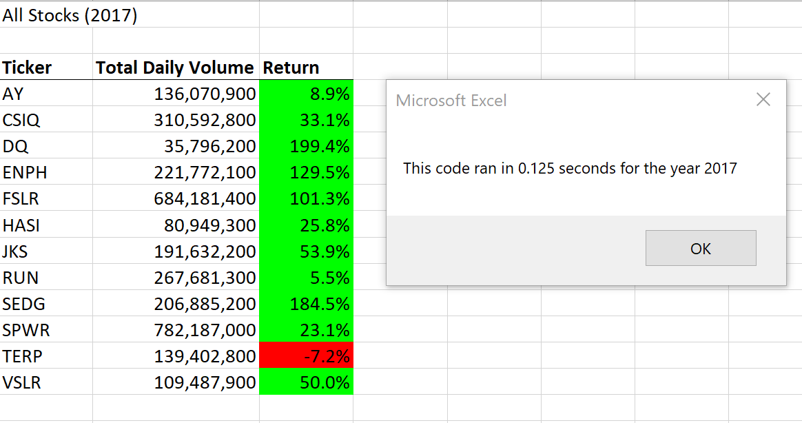

# Stock-analysis
Stock Analysis of various green energy stocks

## Overview of the Project
    The purpose and background are well defined
    Steve who has just graduated with his finance degree. His proud parents who are very passionate about green energy want to be his first client and want to invest in green energy under his guidance.
    As there are differnt types of green energy from hydro, geothermal, wind and Bio, Steve's parents haven't been able to do much research.  But they are inclined towards investing their entire money in DAQO Energy, which makes silicon wafers for solar panels. As Steve’s parents met at Dairy Queen(DQ) which matches with the ticker symbol ‘DQ’ of DAQO (DQ), hence it has an emotional value for them. 
	As Steve is concerned about diversifying stocks, he wants to get a better understanding of all the other stocks of green energy in order to be able to help his parents make the right decision related to their investment. 
	As all the info is on excel, we will be using an extension to Excel known as Visual Basic for Applications (VBA), a programming language used to help automate the task. Will be using VBA to read and write on the cells in excel sheet, make calculations and using complex logic to perform analysis on any stock and reducing the chances of manual error. 

## Results
    The analysis is well described with screenshots and code
### 1. DQ’s yearly return for 2018 – As Steve’s parents had a personal preference of investing in the share of DQ, Steve wanted to analyze the yearly return of DQ for the year 2018.
	In order to analyze the yearly return for 2018, we wrote the following pseudocode:
1.	Loop through all the rows.
2.	Check if the current row is the first row of DQ's data.
3.	If so, set the starting price to the closing price in the current row.
We set the ticker to ‘DQ’ in order to derive the values related to DQ. We used the for loop in the code in order to check the value of the ticker ‘DQ’.
Code is as follows:
'loop over all the rows
    For i = 2 To RowCount
        If Cells(i, 1).Value = "DQ" Then
            'increase totalVolume by the value in the current row
            totalVolume = totalVolume + Cells(i, 8).Value
        End If
        If Cells(i - 1, 1).Value <> "DQ" And Cells(i, 1).Value = "DQ" Then
            startingPrice = Cells(i, 6).Value
        End If
        If Cells(i + 1, 1).Value <> "DQ" And Cells(i, 1).Value = "DQ" Then
            endingPrice = Cells(i, 6).Value
        End If

As per the analysis, we found that Daqo dropped over 63% in 2018. Although there could potentially be different reasons for the drop in the returns, but this is a good enough analysis that proves that Steve should look other stock options.
### 2. Stock Analysis Output for all stocks for the year 2017 and 2018
In order to get a better understanding of the potential stocks and to arrive to a conclusion, it was important to analyze stocks of different companies. Hence, we ran a code on the stocks to understand the yearly output for both the years.

The following pseudocode was used before writing the code for the above analysis:

Step 1a:
•	Create a tickerIndex variable and set it equal to zero before iterating over all the rows. You will use this tickerIndex to access the correct index across the four different arrays you’ll be using: the tickers array and the three output arrays you’ll create in 

Step 1b:
•	Create three output arrays: tickerVolumes, tickerStartingPrices, and tickerEndingPrices.
o	The tickerVolumes array should be a Long data type.
o	The tickerStartingPrices and tickerEndingPrices arrays should be a Single data type.

Step 2a:
•	Create a for loop to initialize the tickerVolumes to zero.
Step 2b:
•	Create a for loop that will loop over all the rows in the spreadsheet.

Step 3a:
•	Inside the for loop in Step 2b, write a script that increases the current tickerVolumes (stock ticker volume) variable and adds the ticker volume for the current stock ticker.
o	Use the tickerIndex variable as the index.
Step 3b:
•	Write an if-then statement to check if the current row is the first row with the selected tickerIndex. If it is, then assign the current starting price to the tickerStartingPrices variable.
Step 3c:
•	Write an if-then statement to check if the current row is the last row with the selected tickerIndex. If it is, then assign the current closing price to the tickerEndingPrices variable.

Step 3d:
•	Write a script that increases the tickerIndex if the next row’s ticker doesn’t match the previous row’s ticker.

Step 4:
•	Use a for loop to loop through your arrays (tickers, tickerVolumes, tickerStartingPrices, and tickerEndingPrices) to output the “Ticker,” “Total Daily Volume,” and “Return” columns in your spreadsheet.
As there are quite a few tickers, we had to create an array of tickers. Again, we used a lot of code from our earlier DQ Analysis here. The for loops were again used in order to derive the starting and ending price for each ticker for the respective year. Also, in order to make the analysis automated, we used the code to input the year for which the analysis needs to run. This will give Steve the flexibility to use the same code for any other year other than the ones he currently has data on. 

Here are the highlights of the code :

'Initialize array of all tickers
    Dim tickers(12) As String
    tickers(0) = "AY"
    tickers(1) = "CSIQ"
    tickers(2) = "DQ"
    tickers(3) = "ENPH"
    tickers(4) = "FSLR"
    tickers(5) = "HASI"
    tickers(6) = "JKS"
    tickers(7) = "RUN"
    tickers(8) = "SEDG"
    tickers(9) = "SPWR"
    tickers(10) = "TERP"
    tickers(11) = "VSLR"
'1b) Create three output arrays
        Dim tickerVolumes(12) As Long
        Dim tickerStartingPrice(12) As Single
        Dim tickerEndingPrice(12) As Single
For j = 2 To RowCount
'3a) Increase volume for current ticker
            
               tickerVolumes(i) = tickerVolumes(i) + Cells(j, 8).Value
        '3b) Check if the current row is the first row with the selected tickerIndex.
        'If  Then
            If Cells(j - 1, 1).Value <> tickers(i) And Cells(j, 1).Value = tickers(i) Then
               tickerStartingPrice(i) = Cells(j, 6).Value
           End If
        '3c) check if the current row is the last row with the selected ticker
         'If the next row’s ticker doesn’t match, increase the tickerIndex.
        'If  Then
            If Cells(j + 1, 1).Value <> tickers(i) And Cells(j, 1).Value = tickers(i) Then
               tickerEndingPrice(i) = Cells(j, 6).Value
      `End If
          '3d Increase the tickerIndex.
            If Cells(j + 1, 1).Value <> tickers(i) Then
                i = i + 1
            End If
## Results : 
    A closer look at the results proves that the stocks of DQ and SEDG had returns of more than 150% and stocks of ENPH and FSLR has returns more than 100% in the year 2017. 

	The results of 2018 conclude that the stocks of ENPH and RUN had more than 80% returns whereas most of the stocks went in loss. The returns of a lot of stocks was in negative.

	
    According to the above analysis, we can conclude the following:
        1.	We need to check the accuracy of the data. This represents good chances of inaccuracy and hence a validation will be helpful.
        2.	The data is only for 2 years in which one of the years the green energy stocks have performed extremely well and in the other year the stocks have fallen down in price. Hence data of more than 2 years will be required in order for better comparison.
        3.	The stocks have had very low returns in the year 2018 which could be a result of a lot of factors like economy, any issues with green energy fuels or due to changes in the investment pattern of the investors.
## Summary of the project
1.	What are the advantages or disadvantages of refactoring code?
        
    After refactoring the code, we found that the biggest advantage of refactoring the code is directly related to the performance of the code. The code is able to run faster. 

    So far there are no disadvantages in the code except while defining the arrays of the tickers there should be a possibility to define the arrays in the ticker list by writing a single code instead of defining the variable for all the 12 ticker names individually.

2.    How do these pros and cons apply to refactoring the original VBA script?
    The pros of refactoring the original script are that the current code is more detailed and clearer to understand for anyone who refers to the code in future. Also the code has flexibility to incorporate more data in the future related to stock data of more than two years. The performance of the code had drastically improved… from 0.78 seconds to under 0.15 seconds (please refer the images above).

	We don’t see any cons in the code so far.
